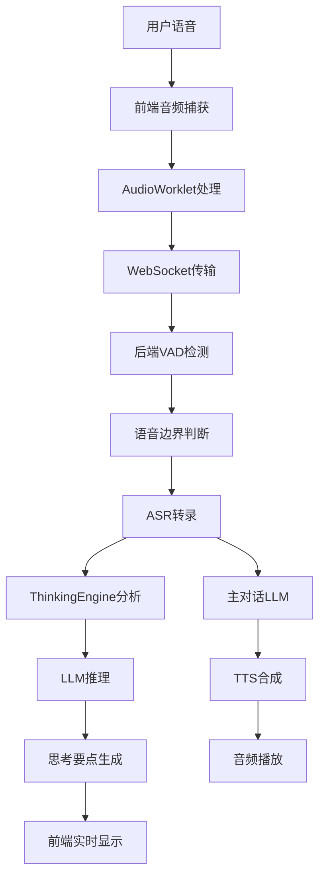

# 实时语音面试作弊助手 - 系统设计文档

## 📋 项目概述

### 项目名称
Live Voice Chat Demo - 实时语音面试作弊助手

### 项目目标
构建一个具备"边听边想"能力的面试作弊 Agent，在面试官说话过程中同步进行思考和信息检索，实时展示思考要点，帮助用户从容应对技术面试。

### 核心价值
- **实时分析**：边听边想，不等面试官说完就开始分析
- **智能辅助**：提供关键词提取、回答要点和技术概念解释
- **多模态支持**：语音输入、文本分析、语音输出的完整闭环
- **低延迟响应**：优化的音频处理和AI推理管道

## 🏗️ 系统架构

### 整体架构图
```
┌─────────────────┐    WebSocket    ┌─────────────────┐
│   Frontend      │◄──────────────►│   Backend       │
│   (Next.js)     │                │   (Node.js)     │
└─────────────────┘                └─────────────────┘
         │                                   │
         ▼                                   ▼
┌─────────────────┐                ┌─────────────────┐
│  Web Audio API  │                │ Multi-Provider  │
│  AudioWorklet   │                │   AI Services   │
│  VAD Client     │                │  ASR/LLM/TTS    │
└─────────────────┘                └─────────────────┘
```

### 技术栈选型

#### 前端技术栈
- **框架**: Next.js 13.3.0 + React 18.2.0
- **语言**: TypeScript 5.0.4
- **样式**: Tailwind CSS 3.3.1
- **UI组件**: Radix UI + 自定义组件
- **音频处理**: Web Audio API + AudioWorklet
- **实时通信**: WebSocket
- **状态管理**: React Hooks

#### 后端技术栈
- **运行时**: Node.js
- **框架**: Express.js 4.21.1
- **实时通信**: WebSocket (ws 8.18.0)
- **音频处理**: 
  - ONNX Runtime (Silero VAD)
  - FFmpeg (fluent-ffmpeg)
  - WAV处理库
- **AI集成**: Axios + 多提供商适配器
- **测试框架**: Mocha 10.2.0

## 🎯 核心功能模块

### 1. 音频处理模块

#### 前端音频捕获
```typescript
// 音频捕获和处理流程
WebAudio API → AudioWorklet → VAD检测 → WebSocket传输
```

**关键特性**:
- 实时音频捕获 (16kHz采样率)
- 客户端VAD预处理
- 音频块流式传输
- 自动增益控制

#### 后端音频处理
```javascript
// 服务端音频处理管道
WebSocket接收 → Silero VAD → 语音边界检测 → ASR转录
```

**关键特性**:
- 高精度Silero VAD模型
- 可配置的语音检测阈值
- 音频格式标准化
- 实时转录触发

### 2. 多提供商AI服务

#### ASR (语音转文字) 提供商
| 提供商 | 模型 | 特点 | 适用场景 |
|--------|------|------|----------|
| OpenAI | Whisper-1 | 高精度，多语言 | 准确性优先 |
| SiliconFlow | SenseVoice | 低延迟，中文优化 | 实时性优先 |

#### LLM (大语言模型) 提供商
| 提供商 | 模型 | 特点 | 适用场景 |
|--------|------|------|----------|
| OpenAI | GPT-4o | 推理能力强 | 复杂问题分析 |
| OpenRouter | GPT-4o/Gemini | 无地域限制 | 全球部署 |
| ARK | Doubao | 中国优化 | 国内低延迟 |
| Kimi | Moonshot-v1-32k | 长上下文 | 复杂对话 |

#### TTS (文字转语音) 提供商
| 提供商 | 模型 | 特点 |
|--------|------|------|
| SiliconFlow | Fish Audio 1.5 | 自然语音合成 |

### 3. 智能思考引擎

#### ThinkingEngine 架构
```javascript
class ThinkingEngine {
  // 双模式运行机制
  processTranscript()     // 主处理入口
  generateLLMThoughts()   // LLM智能分析
  processTranscriptBasic() // 基础模式回退
  
  // 状态管理
  currentThoughts: Map    // 当前思考状态
  processingQueue: Map    // 请求队列管理
}
```

**核心能力**:
- **实时分析**: 边听边想，不等完整输入
- **关键词提取**: 技术概念自动识别
- **回答要点生成**: 结构化思考框架
- **容错机制**: 多层回退保证稳定性

## 📊 数据流程设计

### 实时语音处理流程


### 消息协议设计

#### WebSocket消息类型
```typescript
interface WebSocketMessage {
  // 音频数据
  type: 'audio_chunk' | 'audio_end'
  data: ArrayBuffer | null
  
  // 控制消息
  type: 'ping' | 'pong' | 'start_recording' | 'stop_recording'
  timestamp: number
  
  // AI响应
  type: 'transcript' | 'thinking' | 'ai_response' | 'tts_audio'
  content: string | ThinkingEntry[]
  isFinal: boolean
}
```

#### 思考对象数据结构
```typescript
interface ThinkingEntry {
  id: string                    // 唯一标识
  timestamp: number            // 时间戳
  type: 'keyword' | 'concept' | 'thought'  // 思考类型
  content: string              // 显示内容
  keywords?: string[]          // 关键词数组
  confidence?: number          // 置信度 (0-1)
}
```

## 🔧 配置管理系统

### 提供商配置架构
```javascript
const config = {
  // 提供商选择
  ASR_PROVIDER: 'siliconflow',
  LLM_PROVIDER: 'kimi', 
  TTS_PROVIDER: 'siliconflow',
  
  // 提供商配置
  ASR_PROVIDERS: { /* 配置映射 */ },
  LLM_PROVIDERS: { /* 配置映射 */ },
  TTS_PROVIDERS: { /* 配置映射 */ },
  
  // 系统参数
  VAD_THRESHOLD: 0.5,
  AUDIO_SAMPLE_RATE: 16000,
  SYSTEM_PROMPT: '面试作弊助手提示词'
}
```

### 环境变量管理
```bash
# API密钥配置
OPENAI_API_KEY=sk-xxx
OPENROUTER_API_KEY=sk-or-xxx  
ARK_API_KEY=xxx
SILICONFLOW_API_KEY=sk-xxx
KIMI_API_KEY=sk-xxx
```

## 🎨 用户界面设计

### 主界面布局
```
┌─────────────────────────────────────────────────────────┐
│                    控制按钮区域                          │
│              [开始录音] [停止录音] [清除]                 │
├─────────────────┬─────────────────┬─────────────────────┤
│                 │                 │                     │
│   对话历史区域   │   AI思考区域    │      日志区域       │
│                 │                 │                     │
│  - 用户语音转录  │  - 实时关键词   │   - 系统日志        │
│  - AI回答       │  - 思考要点     │   - 延迟监控        │
│  - 语音播放     │  - 技术概念     │   - 错误信息        │
│                 │                 │                     │
└─────────────────┴─────────────────┴─────────────────────┘
```

### 响应式设计
- **桌面端**: 三栏布局，信息密度高
- **移动端**: 标签页切换，单栏显示
- **自适应**: 基于屏幕尺寸动态调整

## 🚀 性能优化策略

### 音频处理优化
- **流式处理**: 避免大块音频缓存
- **VAD优化**: 客户端+服务端双重检测
- **采样率优化**: 16kHz平衡质量与性能

### AI服务优化  
- **提供商选择**: 基于地域和延迟优化
- **请求合并**: 避免频繁API调用
- **缓存策略**: 重复内容智能缓存
- **重试机制**: 指数退避处理429错误

### 前端性能优化
- **虚拟滚动**: 大量日志数据优化
- **防抖处理**: 用户交互优化
- **内存管理**: 及时清理音频缓存

## 🛡️ 容错与监控

### 多层容错机制
1. **网络层**: 自动重连，请求重试
2. **服务层**: 提供商降级，基础模式回退  
3. **应用层**: 异常捕获，优雅降级
4. **用户层**: 错误提示，操作指导

### 监控指标
- **延迟监控**: 端到端响应时间
- **成功率**: API调用成功率
- **资源使用**: 内存、CPU占用
- **用户体验**: 音频质量，识别准确率

## 📈 扩展性设计

### 水平扩展
- **无状态设计**: 支持多实例部署
- **负载均衡**: WebSocket连接分发
- **数据库集成**: 会话持久化存储

### 功能扩展
- **多语言支持**: 国际化框架
- **插件系统**: 自定义思考引擎
- **API开放**: 第三方集成接口

## 🔒 安全考虑

### 数据安全
- **API密钥管理**: 环境变量隔离
- **音频数据**: 临时存储，定期清理
- **传输加密**: WSS安全连接

### 隐私保护
- **本地处理**: 敏感数据本地化
- **数据最小化**: 只传输必要信息
- **用户控制**: 数据删除权限

## 💻 技术实现细节

### 关键类和模块设计

#### 1. ConnectionHandler (后端核心)
```javascript
class ConnectionHandler {
  constructor(ws) {
    this.ws = ws;                    // WebSocket连接
    this.messageHistory = [];        // 对话历史
    this.audioChunks = [];          // 音频缓存
    this.thinkingEngine = new ThinkingEngine(config);
    this.vadProcessor = new VoiceActivityDetector();
  }

  // 核心方法
  handleMessage(message)           // 消息路由
  processAudioChunk(audioData)     // 音频处理
  handleTranscription(text)        // 转录处理
  generateAIResponse(text)         // AI响应生成
}
```

#### 2. ThinkingEngine (智能分析)
```javascript
class ThinkingEngine {
  // 状态管理
  currentThoughts: Map<string, ThinkingEntry>
  processingQueue: Map<string, string>

  // 核心算法
  async processTranscript(text, isFinal)    // 主处理逻辑
  async generateLLMThoughts(text)           // LLM分析
  async retryLLMRequest(messages, options)  // 重试机制
  parseLLMResponse(response)                // 响应解析
  detectBasicKeywords(text)                 // 基础关键词检测
}
```

#### 3. 提供商工厂模式
```javascript
class LLMProviderFactory {
  static createProvider(providerName, config) {
    switch(providerName) {
      case 'openai': return new OpenAIProvider(config);
      case 'kimi': return new KimiProvider(config);
      case 'ark': return new ARKProvider(config);
      default: throw new Error(`Unknown provider: ${providerName}`);
    }
  }
}
```

### 音频处理管道详解

#### 前端AudioWorklet实现
```javascript
// audioWorklet.js
class AudioProcessor extends AudioWorkletProcessor {
  process(inputs, outputs, parameters) {
    const input = inputs[0];
    if (input.length > 0) {
      const audioData = input[0];

      // VAD预处理
      const speechProbability = this.detectSpeech(audioData);

      // 数据传输
      if (speechProbability > threshold) {
        this.port.postMessage({
          type: 'audio',
          data: audioData.buffer,
          probability: speechProbability
        });
      }
    }
    return true;
  }
}
```

#### 后端Silero VAD集成
```javascript
class VoiceActivityDetector {
  constructor() {
    this.session = new ort.InferenceSession('./models/silero_vad.onnx');
    this.sampleRate = 16000;
    this.frameLength = 512;
  }

  async detectSpeech(audioBuffer) {
    const tensor = new ort.Tensor('float32', audioBuffer, [1, audioBuffer.length]);
    const results = await this.session.run({ input: tensor });
    return results.output.data[0]; // 语音概率
  }
}
```

## 🧪 测试策略

### 单元测试覆盖
```javascript
// 测试用例示例
describe('ThinkingEngine', () => {
  it('should extract keywords from technical questions', async () => {
    const engine = new ThinkingEngine(config);
    const result = await engine.processTranscript('请解释React的虚拟DOM');
    expect(result).toContainKeyword('React');
    expect(result).toContainKeyword('虚拟DOM');
  });

  it('should fallback to basic mode when LLM fails', async () => {
    const engine = new ThinkingEngine({...config, LLM_PROVIDER: 'invalid'});
    const result = await engine.processTranscript('JavaScript闭包');
    expect(result[0].thinkingType).toBe('basic');
  });
});
```

### 集成测试
- **端到端音频流测试**: 模拟完整语音交互
- **多提供商切换测试**: 验证动态切换能力
- **并发连接测试**: 多用户同时使用
- **网络异常测试**: 断网重连场景

### 性能测试
- **延迟测试**: 音频到文本的端到端延迟
- **吞吐量测试**: 并发用户数量限制
- **内存泄漏测试**: 长时间运行稳定性
- **API限流测试**: 429错误处理验证

## 📦 部署架构

### 开发环境
```bash
# 前端开发服务器
cd frontend && npm run dev     # localhost:3000

# 后端开发服务器
cd backend && npm start        # localhost:8848
```

### 生产环境部署
```yaml
# docker-compose.yml
version: '3.8'
services:
  frontend:
    build: ./frontend
    ports:
      - "3000:3000"
    environment:
      - NODE_ENV=production

  backend:
    build: ./backend
    ports:
      - "8848:8848"
    environment:
      - NODE_ENV=production
    volumes:
      - ./backend/models:/app/models
      - ./backend/recordings:/app/recordings
```

### 云部署建议
- **前端**: Vercel/Netlify 静态部署
- **后端**: AWS EC2/阿里云ECS 容器部署
- **CDN**: 音频文件加速分发
- **负载均衡**: Nginx反向代理

## 🔄 版本迭代规划

### v1.0 (当前版本)
- ✅ 基础语音交互功能
- ✅ 多提供商AI服务集成
- ✅ 实时思考引擎
- ✅ 响应式Web界面

### v1.1 (计划中)
- 🔄 语音情感分析
- 🔄 多语言界面支持
- 🔄 用户偏好设置
- 🔄 对话历史持久化

### v2.0 (未来版本)
- 📋 移动端APP
- 📋 离线模式支持
- 📋 自定义AI模型
- 📋 企业级部署方案

## 📚 开发指南

### 环境搭建
1. **Node.js**: 版本 >= 16.0.0
2. **依赖安装**: `npm install` (前后端分别执行)
3. **模型下载**: Silero VAD模型文件
4. **API配置**: 环境变量设置

### 代码规范
- **TypeScript**: 前端强类型约束
- **ESLint**: 代码风格统一
- **Prettier**: 自动格式化
- **Git Hooks**: 提交前检查

### 调试技巧
- **Chrome DevTools**: 前端音频调试
- **WebSocket调试**: 实时消息监控
- **日志分析**: 结构化日志输出
- **性能分析**: 延迟热力图

---

*本文档版本: v1.0*
*最后更新: 2025-08-02*
*文档维护: 开发团队*
